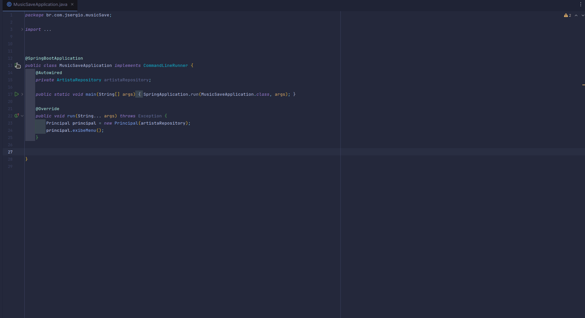

# Projeto Music Save

## Descrição
Esse Projeto faz parte da trilha de aprendizado proposta
pela Alura em parceria com a Oracle. O objetivo é criar um programa que salva artistas e músicas em um banco de dados.

## Objetivos de aprendizado
- Aprender a trabalhar com banco de dados PostgreSQL

## Tecnologias
- Java 17
- Maven
- Spring

## Dependências
- PostgreSQL

## Demo

## Como rodar o projeto
Para rodar o projeto, basta clonar o repositório e abrir o
projeto em uma IDE que suporte Java.
Em seguida, basta rodar a classe `Principal` que está localizada no pacote `br.com.jsergio.musicSave.main`.

## Autor
- José Sergio Pinto da silva

Linkedin: [José Sergio Pinto da Silva](www.linkedin.com/in/josésérgiopsilva)
